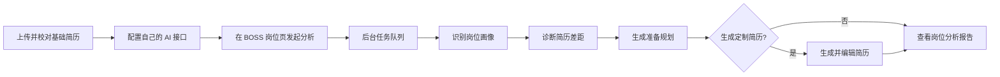

# BOSS直聘岗位分析助手

> 把心仪岗位和自己的简历放在一起，快速看清优势、关键差距，以及真正值得投入的准备方向。

BOSS直聘岗位分析助手是一款基于 Chrome Manifest V3 的本地优先扩展。它不会替用户决定“能不能投”，而是结合岗位描述与基础简历，给出克制、可执行的求职判断：当前是否值得投、优势在哪里、还缺什么、下一步该做什么。

项目没有自建后端，也不绑定模型服务。用户可以接入 DeepSeek 或兼容 Chat Completions 的接口，岗位、简历和分析历史保存在当前浏览器中。

## 核心能力

- **岗位识别**：先判断岗位类型、专业方向和职级，再以对应领域专家视角分析。
- **简历匹配**：结合岗位要求与简历证据，提炼优势、关键差距和投递建议。
- **准备规划**：根据真实差距生成行动项、知识点、短期准备和长期提升路线。
- **面试准备**：当简历达到基本投递要求时，生成与岗位和个人经历相关的面试题。
- **定制简历**：可选生成针对当前岗位的简历，并支持区块编辑、排序、主题色和 PDF 导出。
- **后台队列**：关闭工作台不会中断分析；支持并行任务、失败重试、批量重新分析和批量删除。
- **本地管理**：支持 10、20、30 条历史记录上限，超过后自动淘汰最早的历史任务。

## 工作流程



一次完整岗位分析包含三个 AI 节点：

1. **岗位画像**：识别岗位类别、专业方向、职级和核心任务。
2. **差距诊断**：从对应岗位的专业视角比较简历证据与岗位要求。
3. **准备规划**：围绕已识别的差距生成行动、知识点、学习路线和面试准备。

如果开启“生成定制简历”，会额外执行一次简历生成调用。所有调用费用由用户选择的 AI 服务商收取。

## 快速开始

### 1. 安装扩展

1. 下载或克隆本仓库。
2. 在 Chrome 中打开 `chrome://extensions/`。
3. 开启右上角的“开发者模式”。
4. 点击“加载已解压的扩展程序”。
5. 选择项目根目录。

项目不需要安装依赖，也不需要执行构建命令。

### 2. 完成首次配置

1. 点击扩展图标，打开首页。
2. 上传文本型 PDF 简历。
3. 在简历校对页检查分段、换行和个人信息，然后保存。
4. 选择 DeepSeek 模板，或填写兼容接口的 Base URL、Model 和 API Key。
5. 点击“测试连接”。

### 3. 分析岗位

1. 打开 BOSS直聘岗位详情页。
2. 点击页面右下角的“AI 分析当前岗位”。
3. 任务会直接进入后台队列，工作台可以随时关闭。
4. 分析完成后，在岗位工作台点击“查看结果”。

结果页默认在当前标签页打开。需要保留工作台时，可以右键结果链接，选择在新标签页打开。

## 结果报告

报告围绕实际求职决策组织，而不是输出笼统的匹配分数：

- 是否适合投
- 我有什么优势
- 还需要补什么
- 现在该做什么
- 需要学什么
- 近期准备
- 长期提升
- 面试准备

当简历已经满足岗位要求时，分析允许关键差距和学习项为空，不会为了显得“全面”而故意挑刺。

## 岗位工作台

工作台用于查看队列、进度和历史结果：

- 并行任务支持 1～3 个，默认 2 个，可在扩展快捷菜单中调整。
- 降低并行数不会中断已经运行的任务，只影响后续任务调度。
- 每个任务会冻结入队时的岗位、JD、基础简历和简历生成选项，避免任务之间数据串联。
- 已完成任务支持查看结果、重新分析和删除；失败任务支持重试。
- 已完成、失败和取消的任务可以通过复选框批量重新分析或批量删除。
- 等待中和运行中的任务不会参与批量历史操作。
- 暂停队列只会停止启动新任务，不会强制中断正在进行的 AI 请求。

历史记录可以设置为保留最近 10、20 或 30 条，默认 20 条。超过上限后，扩展会删除最早的已完成、失败或取消任务，以及其中保存的分析结果和简历快照；等待中和运行中的任务不会被删除。

## 快捷菜单

点击扩展图标可以：

- 打开插件首页
- 打开岗位工作台
- 打开基础简历编辑页
- 开启或关闭定制简历生成
- 调整并行任务数量
- 调整历史记录上限

## 项目结构

```text
.
├── assets/                 # 扩展图标等静态资源
├── src/
│   ├── entries/            # service worker、content script 与扩展页面入口
│   ├── features/           # 岗位采集、简历解析、AI 分析、任务队列和导出
│   ├── platform/           # Chrome API 与 IndexedDB 适配层
│   └── shared/             # 常量、通用 UI、设计变量和工具函数
├── tests/                  # 单元测试、架构契约测试和浏览器预览页
├── vendor/                 # 随扩展发布的 PDF.js
└── manifest.json           # Chrome Manifest V3 配置
```

扩展页面和 service worker 使用原生 ES Modules。BOSS 页面中的 content script 按 Manifest 顺序加载经典脚本，因此在不引入打包工具的情况下仍能保持清晰的模块边界。

## 数据与权限

项目采用本地优先设计：

- PDF 只在用户主动上传后于浏览器本机解析。
- 岗位内容只在用户点击分析按钮后读取。
- 基础简历和 AI 配置保存在 Chrome 扩展本地存储中。
- 岗位任务、简历快照和分析结果保存在本机 IndexedDB 中。
- API Key 只会发送到用户配置的 AI 接口，不经过本项目服务器。
- 岗位描述和简历内容会在用户发起分析后发送给所选 AI 服务商。
- 项目不读取 Cookie，不调用 BOSS 未公开接口，不自动投递简历，也不自动发送消息。

扩展默认只对 `www.zhipin.com` 声明页面权限。自定义 AI 接口所需的域名访问权限会在用户保存配置时按域名申请。

## 当前限制

- 仅支持文本型 PDF；扫描件暂不支持 OCR。
- BOSS 页面结构变化后，岗位选择器可能需要同步调整。
- 动态私有字体无法还原且页面无可读元数据时，薪资会被隐藏以避免展示乱码。
- 自定义接口需要兼容 Chat Completions 响应结构：`choices[0].message.content`。
- 接口不支持 `response_format` 时，扩展会在 HTTP 400 后使用普通 JSON 提示词重试。
- 当前通过浏览器打印能力导出 PDF，不直接生成 DOCX。
- 数据不会跨设备同步；移除扩展或清除扩展数据会删除本地简历、配置和历史记录。
- 关闭整个 Chrome、电脑休眠或断网期间无法继续请求，环境恢复后会重新调度未完成任务。

## 本地开发与检查

修改源码后，在 `chrome://extensions/` 中点击扩展的“重新加载”，并刷新已经打开的 BOSS 页面。

使用 Node.js 运行项目检查：

```sh
rg --files src -g '*.js' -g '*.mjs' | xargs -n1 node --check
node --test tests/*.test.cjs tests/*.test.mjs
git diff --check
```

仓库中的 `tests/*-preview.html` 可用于独立检查工作台、结果页、简历编辑器等页面状态。

## 常见问题

### 为什么提示扩展上下文已失效？

重新加载扩展后，已经打开的 BOSS 标签页仍可能保留旧版脚本。刷新对应的 BOSS 页面即可恢复。

### 为什么关闭工作台后分析仍在继续？

任务由扩展的后台 service worker 执行，工作台只是队列的查看和操作界面。关闭工作台不会取消任务。

### 为什么重新分析会产生新的费用？

重新分析会使用当前基础简历和 AI 配置重新执行完整流程，每个岗位都会产生新的模型调用。

### 为什么报告没有面试题？

只有达到基本投递要求的岗位才会生成针对性面试题。挑战较大的岗位会优先展示差距和准备路线。

## 参与改进

欢迎通过 Issue 描述问题、提供脱敏后的页面现象，或提交聚焦单一问题的 Pull Request。提交代码前，请运行语法检查和全部自动化测试，并避免在测试数据中包含真实简历、API Key 或未经脱敏的岗位信息。
